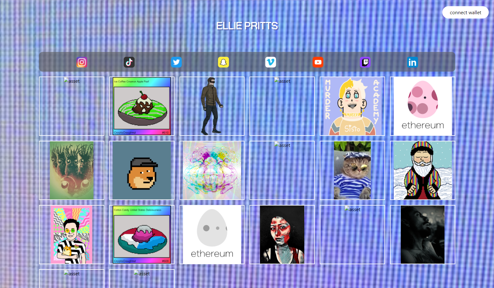
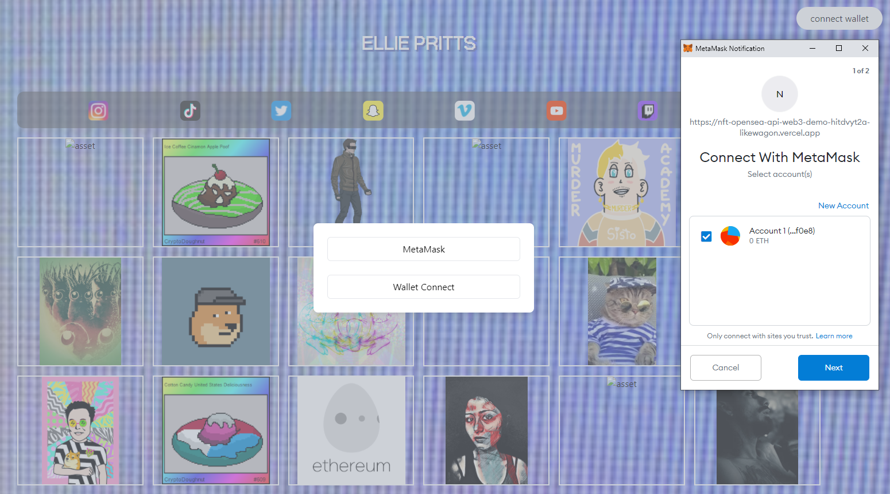
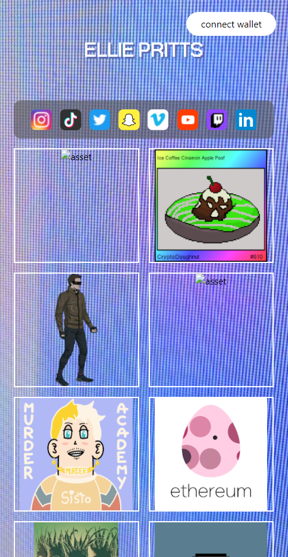
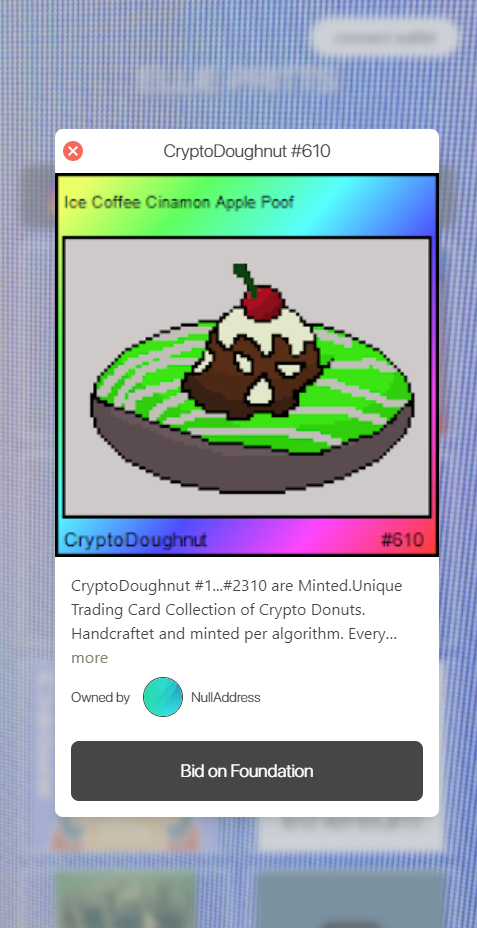

# NFT Application Demo

This is built on Next.js + Typescript + TailwindCSS + OpenSea API + React Web3

[Live Demo](https://nft-opensea-api-web3-demo.vercel.app/)
## Getting Started

First, run the development server:

```bash
yarn dev
```

Open [http://localhost:3000](http://localhost:3000) with your browser to see the result.

## References

[Next.js + Typescript + Tailwind](https://dev.to/waldo/next-js-typescript-tailwind-css-project-setup-4kcj)

[OpenSea API](https://docs.opensea.io/reference) 

[web3-react](https://github.com/NoahZinsmeister/web3-react)

## Screenshots







